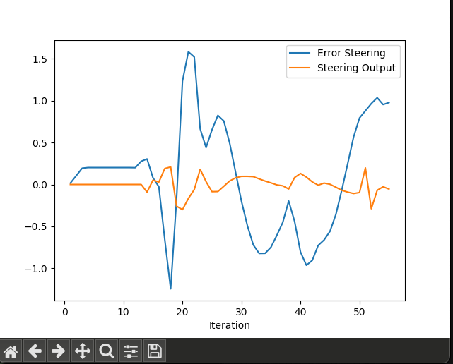
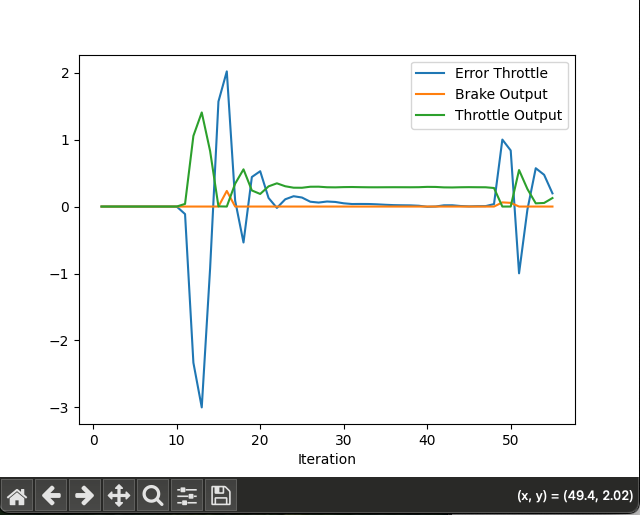

# Submission
* Project "Control and Trajectory Tracking for Autonomous Vehicles"
* Sune Kaae

# Plot
## Steering

* "Error Steering" is the variable error_steer = -sin(yaw) * dx + cos(yaw) * dy
    * it is the Cross Track Error (CTE) for Y.
* "Steering Output" is the actual value used for steering change/actuation.
* as the error build then the output counteract with change in the "opposite" direction

## Throttle

* "Error Throttle" is the variable error_throttle = velocity - v_points[0];
    * it is the Cross Track Error (CTE) for for the velocity delta of current velocity and planned velocity at first waypoint
* "Brake Output" and "Throttle Output" is the actual value used for brake/throttle change/actuation.
    * They are mutually exclusive, representing a negative or positive movement on the x axis
* as the error build then the output counteract with change in the "opposite" direction

# PID dynamics
* There are three elements to PID:
* P: proportional, which aims to directly counteract the calculated error - using a proportional correction
* D: derivative, which smoothes the correction and reduces the phenomenon of overshooting the desired correction and oscillation. uses the rate of change
* I: integral, which sums all the errors and addresses steady-state/systematic bias

# Critical analysis of  controller

## How would you design a way to automatically tune the PID parameters?
* the Twiddle approach should do a good job of this.
* each of the 3 parameters gets an initial value (guestimate)
* for each parameter we also have an initial step-size
* by trial & error we iterate through different values for each parameter
    * first test if the result is better with an increase/decrease of the step size. if so then keep that value and increase the step size 10%
    * if not, then leave the parameter as it is, and instead reduce the step-size by 10%
* done when the sum of all the step sizes is smaller than some threshold
* this approach optimizes the parameter individually. there is a risk of a local optimum though.
* the error can be defined as total error (total CTE) across a given timewindow or lap on a course

## Model free versus model based controller
* Pros
    * controller can be built and tested in isolution from the model
    * controller be be reused across many use cases / vehicles
* Cons
    * controller doesn't know anything about the model or world/domain it is controlling, for example weather or road conditions
    * doesn't know how to anticipate anything and just reacts to things and therefore likely to overshoot (and oscillate)

## What would you do to improve the PID controller?
* the controller is really in need of optimization
    * I would separate the parameters for PID into a text/configuration file so I don't need to recompile every time I was to test a change
    * experiment with different parameters in a structured and automated way
* make path planning consider vehicles current location
    * it seems that current path planning is progressing each time step independently of what the vehicle did and where it is
    * this makes troubleshooting and optimisation even more difficult because it can be difficult to understand what path the vehicle is trying to follow (a path which is far ahead)
    * change the path planning approach to always start based on where the vehicle is

# Video
<video controls src="drive.mov" title="Video"></video>